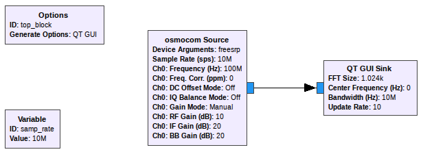

Setting up GNU Radio for use with the FreeSRP
=============================================

Installing
----------

The FreeSRP is supported in GNU Radio through `gr-osmosdr`. Prebuilt packages of `gr-osmosdr` for Ubuntu with FreeSRP support are available from the `FreeSRP PPA <https://launchpad.net/~llb/+archive/ubuntu/freesrp>`_.

If you are not using Ubuntu, you will have to build gr-osmosdr from source.

Ubuntu
++++++

In the Getting Started guide, you should already have installed `libfreesrp` and `freesrp-firmware`. Now, you will need to install GNU Radio, gr-osmosdr and other required dependencies. The easiest and most reliable way to do this is through the MyriadRF PPA. To add the required repositories and install GNU Radio with FreeSRP support, just run the following commands in a terminal:

.. code:: bash

    sudo add-apt-repository -y ppa:bladerf/bladerf
    sudo add-apt-repository -y ppa:ettusresearch/uhd
    sudo add-apt-repository -y ppa:myriadrf/drivers
    sudo add-apt-repository -y ppa:myriadrf/gnuradio

    sudo apt update

    sudo apt install gnuradio gnuradio-dev gr-osmosdr

Gqrx
****

If you wish to also install `Gqrx <http://gqrx.dk/>`_, you need to add one additional PPA:

.. code:: bash

    sudo add-apt-repository -y ppa:gqrx/gqrx-sdr
    sudo apt update
    sudo apt install gqrx-sdr
    

Building from source
++++++++++++++++++++

Coming soon!

Testing your installation
-------------------------

You should now have GNU Radio fully set up and ready for use with the FreeSRP.

To try it out, start up GNU Radio Companion (GRC) from your main menu or run `gnuradio-companion`. To add a signal source from the FreeSRP, add the `osmocom Source` block to the flow graph. Double-click it to configure it. You will need to set the "Device Arguments" to "freesrp". Now close this window, and set the sample rate higher (as the default of 32k is too low for the FreeSRP): double click on the `Variable` block with ID "samp_rate" and change the value to something between `1e6` (1 MSps) and `61.44e6` (61.44 MSps, the maximum). Trying a lower sample rate first, like 1 to 10 MSps is probably a good idea, as not every computer will be powerful enough to handle the higher, 40 MSps+ rates.

Now, add a `QT GUI Sink` block, and connect it to the `osmocom Source`. The `GUI Sink` is a graphical GUI output that you can use to verify the received signal.

For reference, the flow graph you end up with should look like this:

Now, it is ready to be run. Click the Play button in the toolbar or press F6 to start it. After you save the flow graph, a window with the `QT GUI Sink` should pop up.

